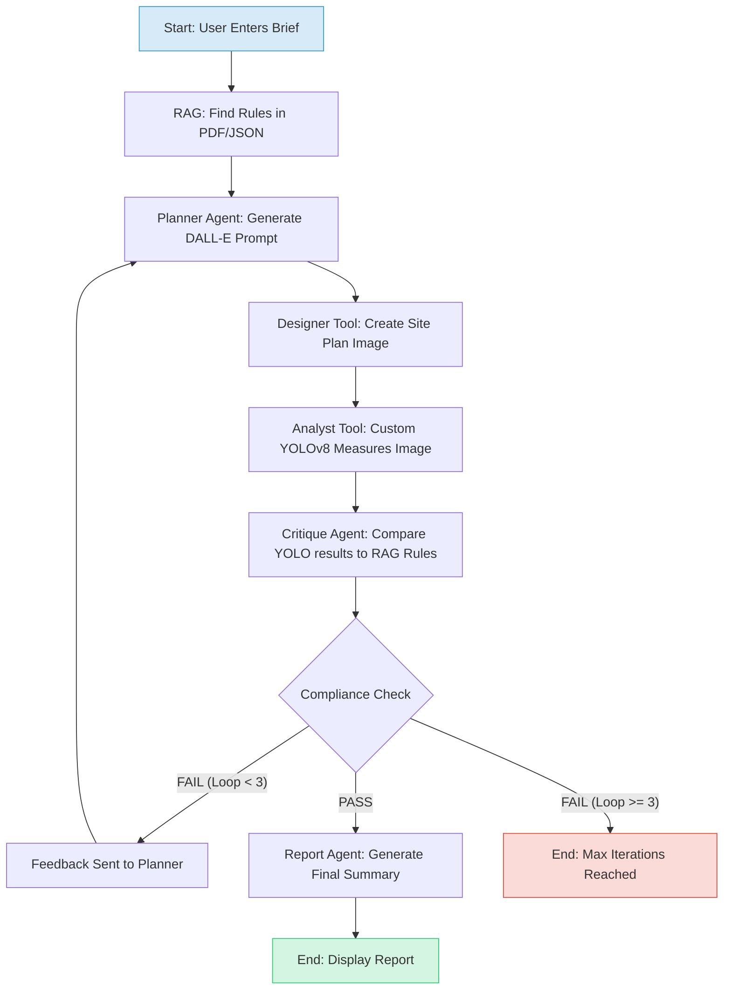

# 🏙️ UrbanPlan AI: A Self-Correcting, Multi-Modal Planning Agent

<p align="center">
  
  
  
  
  
  
</p>

---

**UrbanPlan AI** is an advanced **multi-agent system** that translates natural language **design briefs** into **visually realized, regulation-compliant urban prototypes**.  

It uses an **agentic workflow** to autonomously **design**, **analyze**, **critique**, and **self-correct** its work by comparing a **custom-trained YOLOv8 model’s** analysis against a **RAG knowledge base** of real-world planning documents.

---

## 🚀 Live Demo: The Self-Correction Loop

The app’s core feature is its ability to **identify its own failures and iterate until it succeeds**.

1. 🧾 User Enters Brief  
2. ❌ AI Fails, Critiques, & Tries Again  
3. ✅ AI Succeeds & Reports  

<p align="center">
  
  
  
</p>

---

## 🧠 Core Architecture & Logic

The system’s “brain” is a **stateful graph orchestrated by LangGraph**, enabling **complex, cyclical AI behavior**.


## 🏆 Key Skills & Concepts Demonstrated

| **Skill** | **Description** |
|------------|-----------------|
| 🤖 **Multi-Agent Systems** | Orchestrated a team of specialized AI agents (Planner, Critique, etc.). |
| 🔄 **Agentic Workflows** | Built a stateful, self-correcting loop using LangGraph. |
| 🛠️ **Tool Use** | Enabled agents to reliably use custom-built tools (Vision, RAG). |
| 👁️ **Computer Vision (MLOps)** | Fine-tuned a YOLOv8 model on a custom dataset for domain-specific analysis. |
| 🎨 **Multi-Modality** | Bridged NLP (GPT-4o), Image Gen (DALL·E 3), and CV (YOLOv8). |
| 📚 **RAG** | Grounded AI in facts using a ChromaDB vector store of PDF/JSON documents. |
| 💻 **Full-Stack App** | Developed a complete Streamlit frontend with a modular Python backend. |
| 🧠 **Observability** | Integrated LangSmith to trace and debug complex agent behavior. |

---

## 🛠️ Tech Stack

| **Category** | **Technology** |
|---------------|----------------|
| **AI Orchestration** |   |
| **AI Observability** |  |
| **Language & Vision** |  |
| **Computer Vision** |    |
| **Web Framework** |  |
| **Vector Database** |  |
| **Core Stack** |   |

---
## 🎨 Sample Design Gallery

Examples of complex designs generated and analyzed by the system:

| **Sample 1** | **Sample 2** |
|---------------|--------------|
|  |  |

---

## 🏃‍♂️ Run Locally

### 1️⃣ Prerequisites

This project requires the custom-trained YOLOv8 model file:

```bash
/models/urbanplan_yolov8.pt
```

### 2️⃣ Clone Repository

```bash
git clone https://github.com/[YOUR-USERNAME]/[YOUR-REPO-NAME].git
cd [YOUR-REPO-NAME]
```
### 3️⃣ Create Virtual Environment

```bash
python -m venv venv

# On macOS/Linux
source venv/bin/activate

# On Windows
.\venv\Scripts\activate
```
### 4️⃣ Install Dependencies

```bash
pip install -r requirements.txt
```
### 5️⃣ Configure Environment
Create a .env file in the project root:
```bash
# .env
OPENAI_API_KEY="sk-..."
LANGCHAIN_TRACING_V2="true"
LANGCHAIN_API_KEY="ls__..."
LANGCHAIN_PROJECT="UrbanPlan AI"
```
### 6️⃣ Run the Application 

The first run will take a minute to build the ChromaDB vector store.

```bash
streamlit run streamlit_app.py
```
Then open your browser to:

👉 http://localhost:8501

<p align="center"> <b>💡 UrbanPlan AI — Turning ideas into verified designs.</b> </p> 
